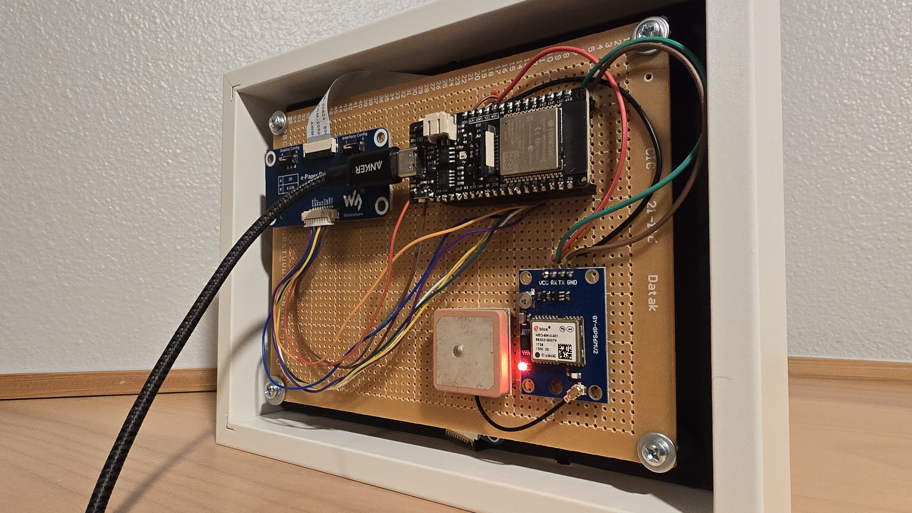

# E-ink Display Clock with Moon Phase Visualization

This project is an ESP32-based e-ink display clock that visualizes time, date, and moon phase information. It leverages GPS for accurate time and location data and displays special content on significant dates such as astronomical events and space history milestones.

## Features

- **Time & Date Display:** Shows current time, date, and day of the week.
- **Moon Phase Visualization:** Calculates and displays the current moon phase with both a simple and a 3D-simulated version, including poetic default texts when no special astro event occurs.
- **Special Dates:** Displays special images on specific dates (e.g. images for Stephen Hawking, Edwin Hubble, Luna, etc.).
- **Deep Sleep Mode:** Optimizes power consumption by entering deep sleep until midnight.

## Hardware

- **E-ink Display:** Uses a 750c Z08 e-ink display. ([Product page](https://www.waveshare.com/product/7.5inch-e-paper.htm))
- **GPS Module:** Utilizes a TinyGPSPlus module for obtaining time and location data.
- **ESP32:** Developed and tested on an ESP32 board, leveraging its advanced features for power management and connectivity.
- **E-Paper Driver HAT:** [E-Paper Driver HAT](https://www.waveshare.com/wiki/E-Paper_Driver_HAT)

## Project Structure

- **src/** — Contains the source code files.
  - **main.cpp:** Main program flow; handles display updates, moon phase calculations, and sleep management.
  - **events.cpp/h:** Implements data and functions for astronomical events.
  - **moonphase.cpp/h:** Contains the logic for moon phase calculations.
  - **timezone.cpp/h:** Provides timezone decoding based on GPS location.
- **docs/** — Contains documentation and project images.
- **images/** — Contains images used by the program (e.g., bitmaps for various space images).

## Embedded Images

### Front View

### Back View

## Moon Photography

A sharp image of the moon was captured by Travis Cunningham using acquisition settings of `200 × 2.00ms` with a William Optics Zenithstar 81 telescope on October 23rd, 2023. [View the original image here](https://app.astrobin.com/i/wigun7). This photograph is used to render the moon display on the clock’s e-ink panel.

## Getting Started

1. **Hardware Setup:** Connect the e-ink display and the GPS module as specified. Ensure all wiring is according to the project schematic.
2. **Software Setup:** Install the required libraries listed in the project documentation. Open the project in your preferred IDE.
3. **Compilation:** Build and upload the code to your ESP32 board.
4. **Operation:** The display will show the current time, date, and moon phase information. If a special event is detected for the day, the display will substitute a corresponding image.

## License

This project is open source. Feel free to modify and use it according to your needs.

## Acknowledgements

- The project utilizes libraries for the e-ink display, GPS parsing, and time management.
- Special thanks to the pioneers of space exploration whose legacy is celebrated through this clock.
